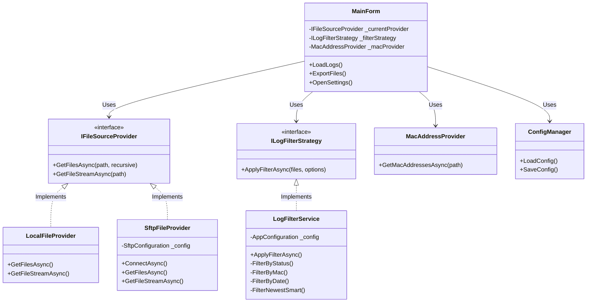
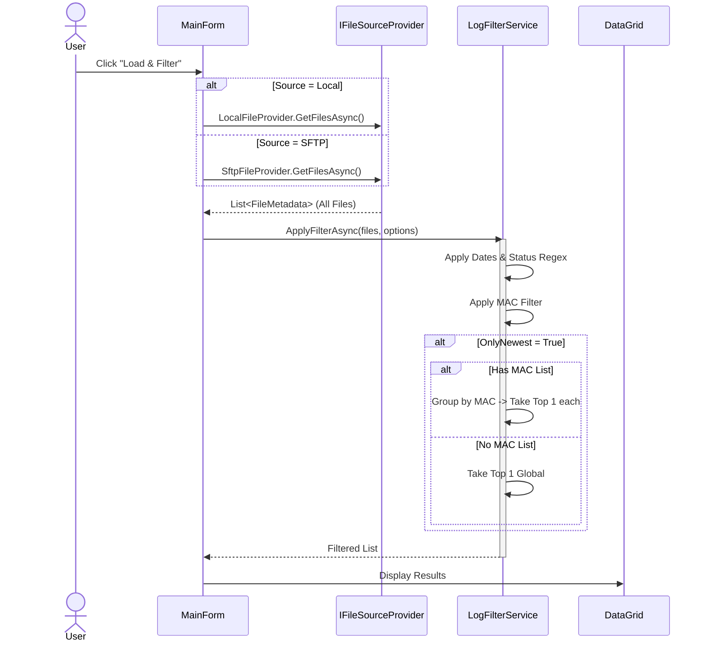
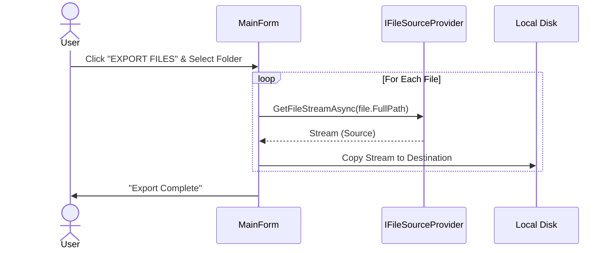

# Log Manager Application

**Log Manager** là ứng dụng Windows Forms (.NET 9) giúp quản lý, lọc và trích xuất file log từ hệ thống Local và SFTP Server một cách hiệu quả.

## Tính Năng Chính
- **Đa Nguồn Dữ Liệu**: Hỗ trợ đọc file từ ổ cứng (Local) hoặc kết nối SFTP an toàn (SSH.NET).
- **Bộ Lọc Thông Minh**:
  - **Theo Ngày**: Lọc file trong khoảng thời gian cụ thể.
  - **Theo Trạng Thái**: Tự động nhận diện PASS/FAIL qua regex cấu hình động.
  - **Theo MAC Address**: Lọc file liên quan đến danh sách thiết bị (MAC).
  - **Smart Newest**: Tùy chọn lấy file mới nhất (Toàn cục hoặc Theo từng MAC).
- **Tìm Kiếm Đệ Quy**: Quét toàn bộ thư mục con.
- **Batch Export**: Sao chép/Tải hàng loạt file đã lọc ra thư mục đích.
- **Cấu Hình Linh Hoạt**: Thay đổi thông số SFTP và Regex ngay trên giao diện (Runtime Config).

## Cài Đặt & Chạy
### Yêu cầu
- .NET 9.0 SDK trở lên.
- Windows OS.

### Chạy ứng dụng
Mở terminal tại thư mục dự án và chạy:
```bash
dotnet run
```
Hoặc mở file `LogManager.sln` bằng Visual Studio.

## Cấu Hình (Appsettings)
Mọi cấu hình được lưu trong `appsettings.json`. Bạn có thể sửa thủ công hoặc dùng menu **Settings** trong app.

```json
{
  "AppConfiguration": {
    "PassPattern": "^PASS_",
    "FailPattern": "^FAIL_",
    "Sftp": {
      "Host": "192.168.1.x",
      "Username": "admin",
      ...
    }
  }
}
```

## Kiến Trúc & Thiết Kế (Architecture & Design)

### 1. Class Diagram
Hệ thống sử dụng **Layered Architecture** và **Dependency Injection**.



### 2. Luồng Xử Lý Chính (Core Flow)

**Load & Filter Process:**


**Export Process:**

